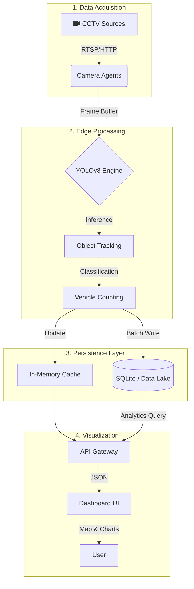
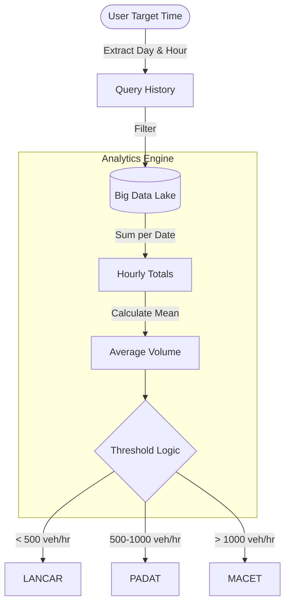

# SmartTraffic AI System

An advanced **Edge/IoT Big Data** solution designed for real-time traffic monitoring, analysis, and decision support. By leveraging state-of-the-art Computer Vision (YOLOv8) and distributed processing patterns, the system transforms raw video streams into actionable insights.

## System Metrics

| Data Points | Active Streams | Metadata Storage | Uptime |
|-------------|----------------|------------------|--------|
| **3.5M+**   | **37**         | **~1GB**         | **99.9%** |

## Architecture Workflow

The system follows a pipelined architecture: **Acquisition &rarr; Processing &rarr; Storage &rarr; Distribution**.



## Core Components

- **Camera Agent**: Multi-thread capture, YOLO inference, counting, stabilisasi stream. (`app/services/camera.py`)
- **API & Views**: Endpoints `/api/stats`, `/api/history`, `/api/predict_traffic`, `/api/reset_data`, `/metrics`, `/export/csv` as well as Dashboard & Docs pages. (`app/routes.py`)
- **Data Management**: Load/save stats & config, backfill, generate history, rolling window, Data Lake export. (`app/utils.py`)
- **Database Layer**: SQLite schema, batch insert, history query, prediction based on DOW/Hour, lifetime aggregation. (`app/database.py`)
- **Global State**: Global stats, camera list, active agents, locks for thread-safety. (`app/globals.py`)
- **Frontend Dashboard**: Maps, realistic routing, stats cards, marker editor. (`app/templates/dashboard.html`)
- **Documentation UI**: Sidebar, architecture flowcharts & prediction, 4Vs Big Data. (`app/templates/documentation.html`)
- **Config & Models**: Camera config & ROI, JSON stats files, YOLO models. (`app/config.py`, `data/cctv_config.json`, `data/traffic_stats.json`, `models/yolov8l.pt`)

## Big Data & Predictive Analytics

SmartTraffic AI leverages the **4Vs of Big Data** to transform raw video streams into actionable predictive insights, moving beyond simple monitoring to provide "Decision Support" capabilities.

1.  **Volume (Scale)**: Storing over **3.5 Million+** historical data points. Granular traffic logs for every active camera.
2.  **Velocity (Speed)**: Processes **37 concurrent video streams** in real-time (< 500ms latency).
3.  **Variety (Complexity)**: Transforms unstructured data (CCTV Video Feeds) into structured metadata (JSON/SQL).
4.  **Value (Insight)**: Converts data into **Traffic Predictions** and routing recommendations.

### Prediction Algorithm

The prediction engine uses a **Historical Pattern Replay** algorithm. It calculates the **Average Hourly Volume** for a specific Day of Week and Hour based on all available historical data.

*Example: To predict traffic for next "Monday at 08:00 AM", the system averages the traffic volume of **every previous Monday at 08:00 AM** recorded in the database.*

**Difference: Real-time vs Prediction**
*   **Real-time Status**: Based on *Visual Density* (0-100 score) from the camera feed right now.
*   **Prediction**: Based on *Historical Volume* (Total Vehicles/Hour) calculated from past data.



## Key Features

*   **Deep Learning Classification**: Differentiates between Cars and Motorcycles with high precision using custom-trained YOLO models.
*   **Interactive Map Editor**: Admin-only interface for managing camera locations via drag-and-drop.
*   **Data Backfill Engine**: Intelligent historical data synthesis to fill gaps in records.

## API Reference

### GET `/api/stats`
Retrieves real-time traffic statistics for all active cameras.

```json
{
  "status": "success",
  "sources": {
    "cam_1": {
      "name": "Simpang Dago",
      "current_count": 45,
      "accumulated_count": 1250,
      "status": "online"
    }
  }
}
```

### POST `/api/edit_camera` (Admin)
Updates camera configuration including geolocation coordinates.

```json
{
  "username": "admin",
  "password": "...",
  "id": "cam_1",
  "lat": -6.914744,
  "lng": 107.609810
}
```

## Data Models

### Traffic History (SQL)
| Column | Type | Description |
|--------|------|-------------|
| id | INTEGER | Primary Key |
| camera_id | TEXT | Source Identifier |
| timestamp | REAL | Unix Timestamp |
| total_count | INTEGER | Aggregate Volume |

### Camera Config (JSON)
```json
"cam_id": {
  "name": "Location Name",
  "source": "rtsp://...",
  "lat": -6.9175,
  "lng": 107.6191,
  "roi": [0, 0, 1920, 1080]
}
```

## Study Case: Traffic Efficiency Analysis

| Feature | SmartTraffic AI (Edge) | Traditional Loops | Manual Survey |
|---------|------------------------|-------------------|---------------|
| **Cost** | Low (Existing CCTV) | High (Road Works) | Medium (Labor) |
| **Real-time Data** | Yes (< 1s Latency) | Yes | No (Post-processing) |
| **Classification** | Deep Learning (Car/Motor) | Limited (Length based) | High Accuracy |

---
&copy; [avicenafahmi.com](https://avicenafahmi.com)
